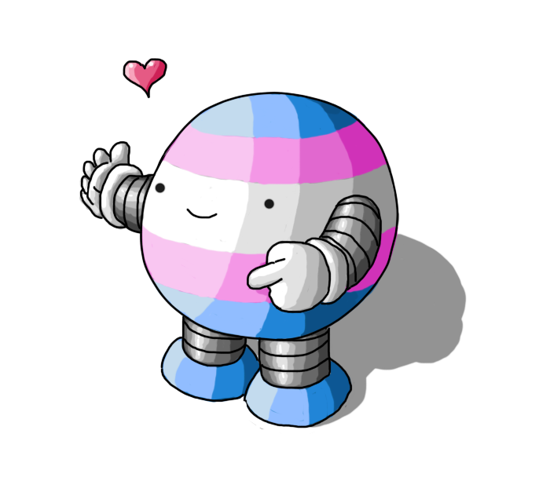

# Trans & NB Solidarity bot

A bot which sends messages of love and solidarity to our
trans and nonbinary friends in the LGBTQ+ community.

The code behind [@transnb](https://twitter.com/transnb)

Project created by [Andy Herd](https://herdingdata.co.uk) (twitter [@herdingdata](https://twitter.com/herdingdata))

The beautiful bot logo was created by [@smolrobots](https://twitter.com/smolrobots)

## First time setup (development)
Make a virtual environment with python 3.8. Then:
```
make setup
make install-git-hooks
```
## First time setup (server)
On a server which you want to post tweets regularly:

```
# Create credentials file
cp src/settings_local.py src/settings.py

# Then put the auth details into src/settings.py from https://developer.twitter.com/en/apps
vi src/settings.py

# Open the crontab in edit mode
crontab -e

TODO zomg there's more to figure out
```

## Commands
```
# Do a tweet of a randomly picked predefined message
transnb-tweet

# Show all the messages
transnb-all
```